## Qu'est-ce que l'architecture N-Tier ?
On entend souvent parler d'architecture N-tiers. Si on a fait des maths, on sait que N est un nombre entier. Mais qu'est-ce que cela signifie dans le contexte de l'architecture logicielle ?

Un tiers (ou "tier" en anglais) est une couche ou un niveau dans une architecture logicielle. L'architecture N-Tier est donc un modèle qui divise une application en plusieurs couches, chacune ayant des responsabilités spécifiques. Le terme "N" indique simplement qu'il peut y avoir plusieurs tiers, généralement trois ou plus.

L'architecture N-Tier est un modèle de conception logicielle qui divise une application en plusieurs couches ou "tiers". Chaque tier est responsable d'une partie spécifique de l'application, ce qui permet une meilleure séparation des préoccupations, une maintenance plus facile et une évolutivité accrue.

## Avantages de l'architecture N-Tier
- **Séparation des préoccupations** : Chaque tier gère une partie spécifique de l'application, ce qui facilite la compréhension et la maintenance du code.
- **Scalabilité** : Les tiers peuvent être déployés sur des serveurs différents, permettant ainsi de répartir la charge et d'améliorer les performances.
- **Réutilisabilité** : Les composants d'un tier peuvent être réutilisés dans d'autres applications ou projets.
- **Flexibilité** : Il est possible de modifier ou de remplacer un tier sans affecter les autres, ce qui facilite l'évolution de l'application.

## Composants typiques d'une architecture N-Tier
- **Tier de présentation** : Gère l'interface utilisateur et l'interaction avec l'utilisateur. Il peut s'agir d'une application web, d'une application mobile ou d'une application de bureau. Evidemment, dans le contexte du backend, on parle souvent d'une API REST.
- **Tier de Domaine/logique métier** : Contient la logique métier de l'application. Il traite les données, applique les règles métier et interagit avec le tier de données.
- ***Tier de données** : Gère l'accès aux données, que ce soit à partir d'une base de données, d'un service web ou d'une autre source de données. Il est responsable de la persistance des données et de leur récupération.
- **

```mermaid
flowchart TD

    subgraph Presentation Layer
        API["🌐 API (REST)"]
    end

    subgraph Application Layer
        Application["🨠 Application<br/>Handlers, Features, DTOs"]
    end

    subgraph Domain Layer
        Domain["💘 Domain<br/>Entities, Business Logic"]
    end

    subgraph Persistence Layer
        Persistence["📈 Persistence<br/>DbContext, Repositories, Dapper"]
    end

    subgraph Clients Layer
        Clients["🌍 Clients<br/>External API Access (ex: DMFA)"]
    end

    subgraph Tests
        AppTests["✅ Application.Tests"]
        ClientsTests["✅ Clients.Tests"]
        PersTests["✅ Persistence.Tests"]
    end

    API --> Application
    Application --> Domain
    Application --> Clients
    Application --> Persistence

    Persistence -- Implements interfaces --> Domain
    Clients -- Implements interfaces --> Domain

    AppTests --> Application
    ClientsTests --> Clients
    PersTests --> Persistence
```
